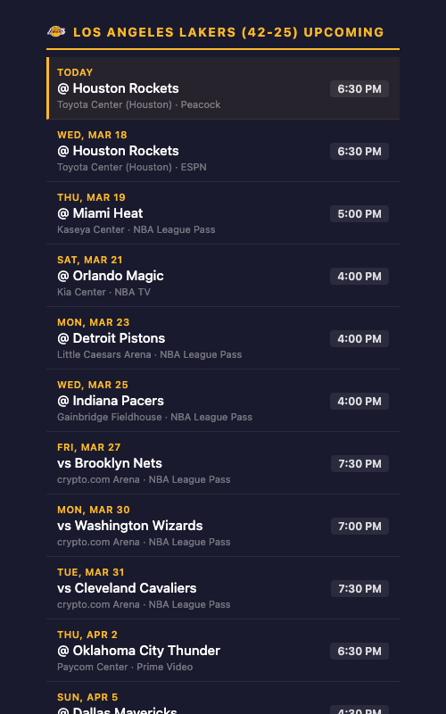
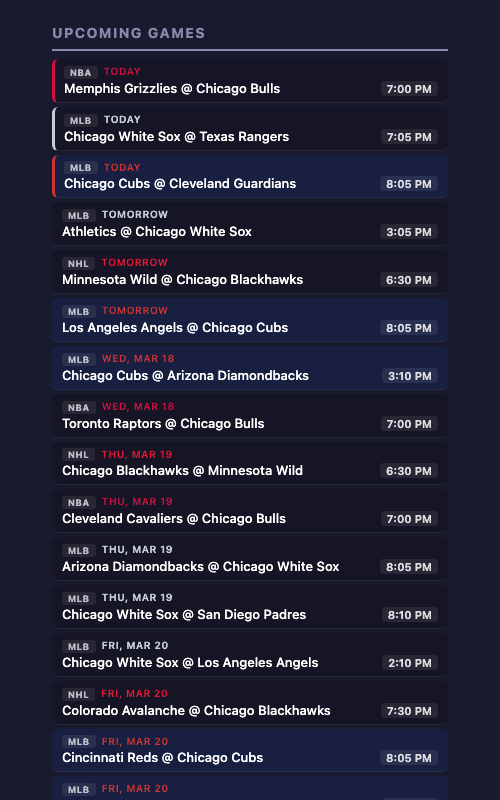
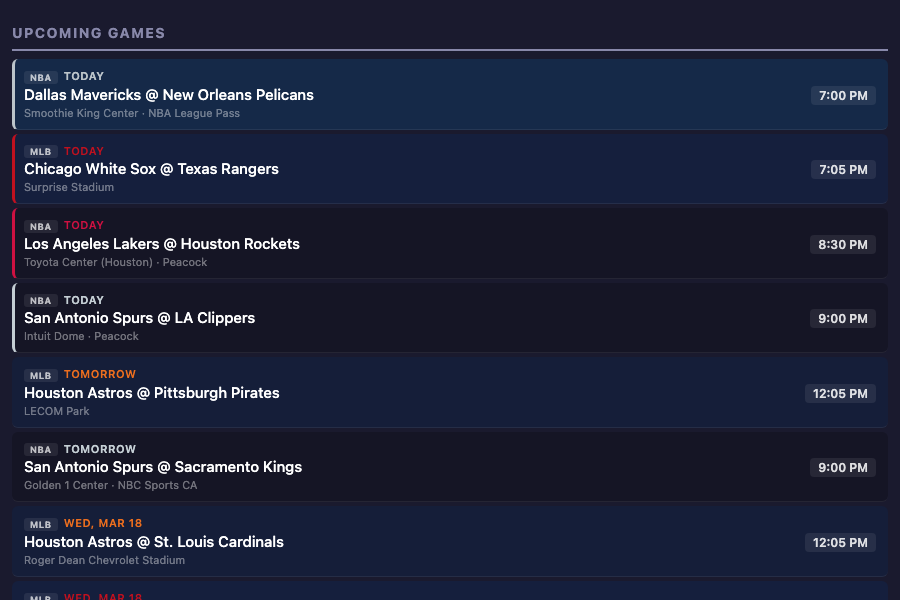
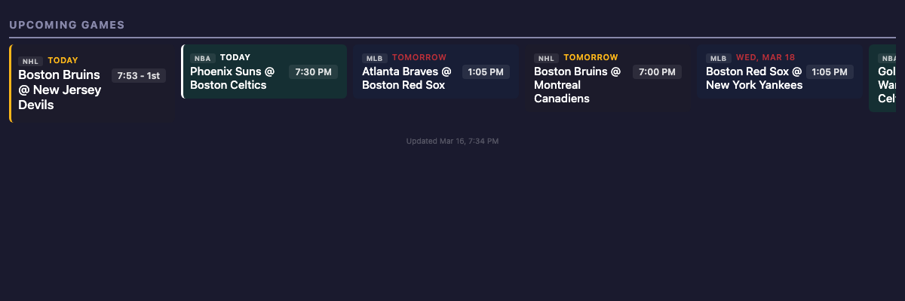
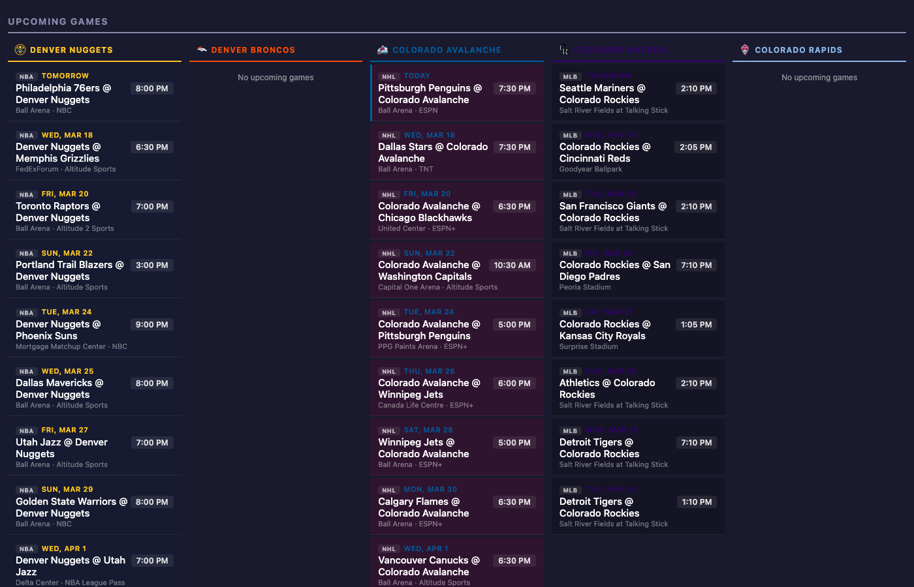
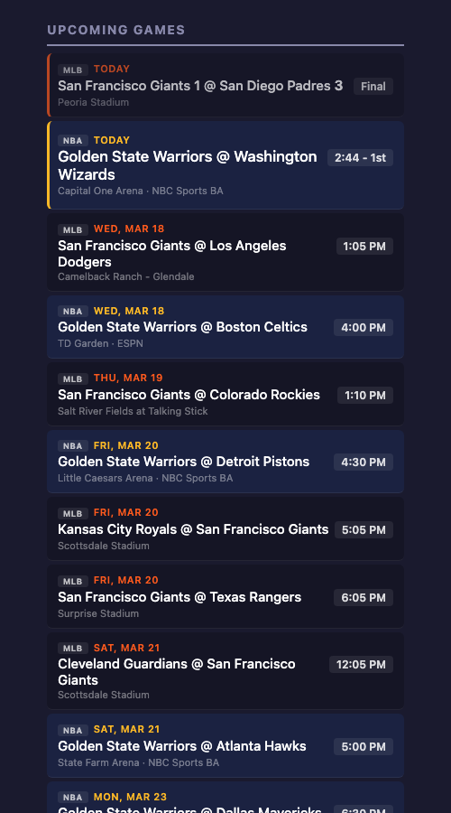
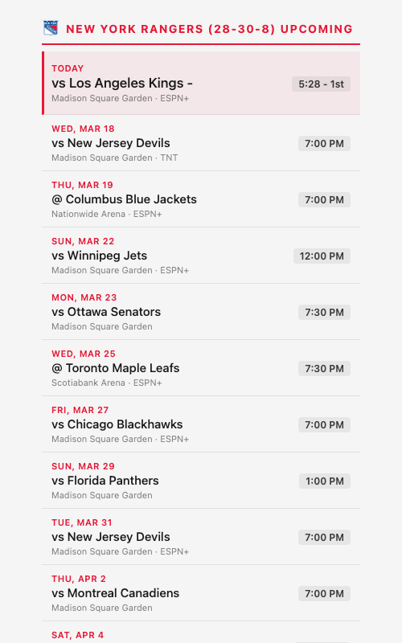

# Sports Schedule Widget

Embeddable sports schedule for home dashboards. Supports NBA, NFL, NHL, MLB, MLS, and WNBA via the ESPN public API — no API key required.



## Quick Start

```bash
docker run -p 6597:6597 \
  -e TEAMS=nba_lakers,nfl_rams \
  -e TZ=America/Los_Angeles \
  sports-widget
```

Embed `http://<host>:6597` as an iframe in Homarr, Dashy, Glance, Heimdall, or any dashboard.

Both `TEAMS` and `TZ` are required.

## Teams

Use `league_team` format: `nba_lakers`, `nfl_broncos`, `nhl_avalanche`, `mlb_rockies`, `mls_atlanta_united`, `wnba_aces`.

Full team list: `TEAM_LOOKUP` in `server.js`.

### Location Shortcuts

```
TEAMS=city_denver        # all Denver teams
TEAMS=state_california   # all California teams
TEAMS=city_newyork       # all NYC teams
```

Mix freely: `TEAMS=city_denver,nba_lakers`

Full location list: `LOCATION_LOOKUP` in `server.js`.

## Layouts

| `LAYOUT` | Description | Default width |
|---|---|---|
| `default` | Stacked rows with venue + broadcast | 420px |
| `compact` | Tighter rows, no venue line | 420px |
| `wide` | Full-width stacked rows | 100% |
| `horizontal` | Side-by-side scrollable cards | 100% |
| `columns` | One column per team | 100% |

Override width with `WIDTH=600` (pixels) or `WIDTH=full`.

<details>
<summary>Layout screenshots</summary>

**Compact** — `LAYOUT=compact` with `city_chicago`:



**Wide** — `LAYOUT=wide` with `state_texas`:



**Horizontal** — `LAYOUT=horizontal` with Boston teams:



**Columns** — `LAYOUT=columns` with `city_denver`:



**Multi-team default** — SF Bay Area teams:



**Light theme** — `THEME=light`:



</details>

## Configuration

| Variable | Required | Default | Description |
|---|---|---|---|
| `TEAMS` | yes | — | Teams or locations |
| `TZ` | yes | — | IANA timezone |
| `PORT` | no | `6597` | Server port |
| `LAYOUT` | no | `default` | Layout mode |
| `WIDTH` | no | per-layout | Container width (px or `full`) |
| `THEME` | no | `dark` | `dark` or `light` |
| `BG_COLOR` | no | per-theme | Background color hex |
| `GAME_COUNT` | no | `20` | Max games (per-team in `columns`) |
| `REFRESH_HOURS` | no | `6` | ESPN data cache TTL |

## Endpoints

| Path | Description |
|---|---|
| `/` | HTML widget |
| `/health` | Health check (`503` warming, `200` ready) |
| `/api/games` | Game data JSON |
| `/api/glance` | [Glance](https://github.com/glanceapp/glance) widget JSON |

## Glance Integration

```yaml
- type: custom-api
  title: Sports
  url: http://<host>:6597/api/glance
  template: |
    {{ range .games }}
      <strong>{{ .title }}</strong> {{ .time }}
      {{ if .score }} · {{ .score }}{{ end }}
    {{ end }}
```

## Dashy Integration

Use Dashy's IFrame widget pointed at `http://<host>:<port>/`.
